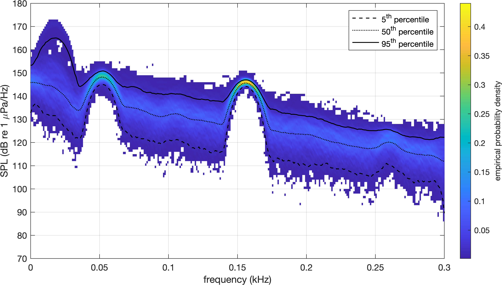

# Spectral probability density 
Matlab code for plotting SPD (spectral probability density) of given audio.

**Reference** N. D. Merchant, T. R. Barton, P. M. Thompson, E. Pirotta, D. T. Dakin, and J. Dorocicz, “Spectral probability density as a tool for ambient noise analysis,” The Journal of the Acoustical Society of America, vol. 133, no. 4, pp. EL262–EL267, Apr. 2013, doi: 10.1121/1.4794934.

# Frequency cross correlation matrix 
